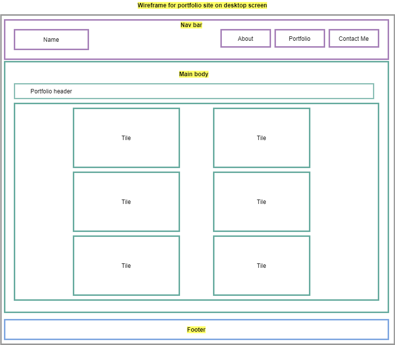

# Portfolio for Krystal E. Duran

This portfolio website was last updated on 6/15/2020. Please reference the content below for a detailed summary of the updates made to my portfolio. At this time my portfolio website now has the following pages to showcase my work:

- About webpage - Provides a short personal bio
- Projects webpage - Dedicated to showcasing my projects
- Fun Facts webpage - Inlcude some fun facts about me
- Contact webpage - Includes a form that a user can fill out to contact me.
  - This feature is not working at the moment, so I included a modal to serve as an error message to warn the reader.

## Links to Portfolio

Here are the links to the GitHub repo and link to deployed portfolio website for your reference.

- Link to GitHub Repo - (https://github.com/KEDuran/Portfolio)[https://github.com/KEDuran/Portfolio]
- Link to Deployed Portfolio Website - (https://keduran.github.io/Portfolio/)[https://keduran.github.io/Portfolio/]

## Updates to Portfolio Website

I updated my reponsive portfolio webiste to include the following

- Links to my LinkedIn and GitHub profiles (both in the bio text and footers on each oage)
- Dedicated page to showcase four high scored assignments (project 1 and three other projects)

* A navbar

* 100 commits

* A responsive layout

* Responsive images

* Create a repository with format <GITHUBUSERNAME>.github.io

  - Example: KEDuran.github.io

* Sample wireframe for the portfolio site when viewed from desktop screen is included below.

  - Note: Overall, layout is responsive and changes with the size of the screen.

